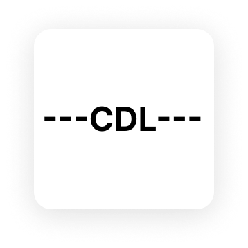

# Compact Data Language (CDL) Specification v2.0

<div align="center">
  
</div>

## Introduction
Compact Data Language (CDL) is a lightweight, human-readable data serialization format optimized for **big data storage and processing**, where **maximum compactness** is paramount. Designed for applications like data lakes, log files, scientific datasets, and large-scale analytics, CDL minimizes storage size through a space-free syntax and single-character delimiters. Unlike formats for real-time communication (e.g., JSON for APIs), CDL prioritizes reducing data footprint and enabling efficient batch processing, making it ideal for terabyte-scale datasets. CDL supports strings, numbers, booleans, nulls, objects, and arrays, ensuring reliability in big data pipelines.

### Goals
- **Maximum Compactness**: Achieve ~20-30% smaller size than JSON by eliminating spaces and using single-character delimiters (e.g., `|`).
- **Efficient Processing**: Enable fast parsing/serialization for large datasets (e.g., millions of records).
- **Reliability**: Explicit key-value mapping prevents ambiguity.
- **Readability**: Maintain human-readable keys for manual inspection, despite space-free design.
- **Interoperability**: Map cleanly to JSON and big data tools (e.g., Hadoop, Spark).

## Table of Contents
1. [Specification](#specification)
   - [Version Control](#version-control)
   - [Core Principles](#core-principles)
   - [Compliance Levels](#compliance-levels)
2. [Syntax](#syntax)
   - [General Structure](#general-structure)
   - [Grammar](#grammar-bnf-like)
   - [Keys](#keys)
   - [Values](#values)
   - [Comments](#comments)
   - [Whitespace](#whitespace)
3. [Semantics](#semantics)
4. [Examples](#examples)
   - [Basic Key-Value](#basic-key-value)
   - [Nested Object](#nested-object)
   - [Array](#array)
5. [Parser Guidelines](#parser-guidelines)
   - [Core Algorithm Pseudocode](#core-algorithm-pseudocode)
     - [Serializer](#serializer)
     - [Deserializer](#deserializer)
     - [Deep Search](#deep-search)
6. [Contributing](#contributing)
   - [Code of Conduct](#code-of-conduct)
   - [Contribution Process](#contribution-process)
   - [Pull Request Guidelines](#pull-request-guidelines)
   - [Development Setup](#development-setup)
   - [Contact](#contact)
   - [License](#license)
7. [Interoperability](#interoperability)

### Example
```
---users:[name|age:Alice,30,Bob,25]---
```
Maps to JSON:
```json
{
  "users": [
    { "name": "Alice", "age": 30 },
    { "name": "Bob", "age": 25 }
  ]
}
```
CDL is ~36% smaller than minified JSON (35 chars vs. 58 chars) and avoids repetitive type prefixes, critical for big data.

## Specification

### Version Control
- Current Version: 2.0
- Release Date: May 2024
- Status: Stable
- Previous Versions: 1.0 (Deprecated)

### Core Principles
1. **Compactness**
   - No whitespace between elements
   - Single-character delimiters
   - Minimal escaping requirements
   - Optimized for storage efficiency

2. **Type System**
   - Primitive Types:
     - String: Quoted or unquoted text
     - Number: Integer or floating-point
     - Boolean: `true` or `false`
     - Null: `null`
   - Complex Types:
     - Object: Key-value pairs in `()`
     - Array: Ordered list in `[]`
   - Custom Types:
     - Type prefix: `t:type_name:value`
     - Number prefix: `n:value`
     - Boolean prefix: `b:value`

3. **Delimiters**
   - Document: `---` (start and end)
   - Key-Value: `:` (separator)
   - Keys: `|` (separator)
   - Values: `,` (separator)
   - Object: `()` (enclosure)
   - Array: `[]` (enclosure)
   - String: `"` (enclosure, optional)

4. **Encoding**
   - Character Set: UTF-8
   - Line Endings: Platform-independent
   - BOM: Not allowed
   - Maximum Nesting: 100 levels
   - Maximum String Length: 1MB
   - Maximum Document Size: 1GB

5. **Validation Rules**
   - Keys must be unique within their scope
   - Values must match their declared types
   - Arrays must be homogeneous
   - Objects must have matching key-value counts
   - Strings must be properly escaped
   - Delimiters must be properly balanced

6. **Performance Characteristics**
   - Serialization: O(n) time complexity
   - Deserialization: O(n) time complexity
   - Memory Usage: O(n) space complexity
   - Search: O(n) time complexity
   - Storage: ~20-30% smaller than JSON

7. **Error Handling**
   - Invalid Format: Throw error with line number
   - Type Mismatch: Throw error with expected type
   - Missing Delimiter: Throw error with context
   - Duplicate Key: Throw error with key name
   - Size Limit: Throw error with limit exceeded

8. **Security Considerations**
   - No executable code
   - No external references
   - No circular references
   - No infinite recursion
   - No resource exhaustion

9. **Compatibility**
   - JSON: Full bidirectional conversion
   - YAML: Partial conversion
   - XML: Partial conversion
   - CSV: Partial conversion
   - Protocol Buffers: Partial conversion

10. **Implementation Requirements**
    - Must validate all rules
    - Must handle all types
    - Must support UTF-8
    - Must be thread-safe
    - Must be memory-efficient
    - Must provide error details
    - Must support streaming
    - Must be well-documented

### Compliance Levels
1. **Basic Compliance**
   - Supports all primitive types
   - Handles basic objects and arrays
   - Validates format rules
   - Provides error messages

2. **Full Compliance**
   - Supports all types including custom
   - Handles nested structures
   - Validates all rules
   - Provides detailed errors
   - Supports streaming
   - Implements security checks

3. **Extended Compliance**
   - All Full Compliance features
   - Schema validation
   - Custom type handlers
   - Compression support
   - Encryption support
   - Performance optimizations

## Syntax

### General Structure
- A CDL document is enclosed between `---` delimiters.
- Content follows: `<meta>:<data>` (no spaces around `:`).
- **Meta**: Keys separated by `|` (no spaces).
- **Data**: Values separated by `,` (no spaces).
- No whitespace is allowed, except within quoted strings, to maximize compactness.

### Grammar (BNF-like)
```
<document> ::= "---" <content> "---"
<content> ::= <meta> ":" <data>
<meta> ::= <key> | <key> "|" <meta>
<key> ::= <word> | '"' <string> '"'
<data> ::= <value> | <value> "," <data>
<value> ::= <string> | <number> | <boolean> | "null" | <object> | <array>
<string> ::= <word> | '"' <escaped_string> '"'
<number> ::= [0-9]+ | [0-9]+\.[0-9]+ | -[0-9]+ | -[0-9]+\.[0-9]+
<boolean> ::= "true" | "false"
<object> ::= "(" <content> ")"
<array> ::= "[" <array_content> "]"
<array_content> ::= <data> | <meta> ":" <data>
<word> ::= [a-zA-Z0-9_-]+
<escaped_string> ::= any character sequence with escaped ", \, \,
```

### Keys
- **Format**:
  - Simple keys: Alphanumeric words (letters, digits, `_`, `-`).
  - Quoted keys: For multi-word or special characters (e.g., `"first name"`).
- **Separator**: `|` (no spaces).
- **Examples**:
  - `name|age`, `user_id|city`.
  - `"first name"|"last name"`.
- **Constraints**:
  - Keys must be unique within a meta section.
  - `|` is reserved, not allowed in unquoted keys.
  - Short keys (e.g., 3-5 chars) are encouraged for compactness.

### Values
CDL supports:
1. **Strings**:
   - Unquoted for simple words: `Alice`, `NewYork`.
   - Quoted for spaces/commas: `"New York"`, `"123,456"`.
   - Escaping: Use `\` for quotes, commas, backslashes (e.g., `"Albany\, NY"`).
2. **Numbers**:
   - Numeric literals: `30` (integer), `3.14` (float), `-42` (negative).
3. **Booleans**:
   - `true`, `false`.
4. **Null**:
   - `null` (valid for any key type).
5. **Objects**:
   - Enclosed in `()`: `(name|age:Alice,30)`.
6. **Arrays**:
   - Enclosed in `[]`: `[Alice,Bob]` or `[name|age:Alice,30,Bob,25]`.

### Comments
- No comments in v2.0 to maximize compactness.

### Whitespace
- No spaces allowed, except within quoted strings (e.g., `"New York"`).
- Leading/trailing whitespace within `---` is ignored.
- **Rationale**: Spaces add ~10% overhead, unacceptable for big data.

## Semantics
- **Key-Value Mapping**: Each key in `<meta>` maps to a value in `<data>`, in order.
- **Arrays**:
  - Format: `[meta:data]` groups values into sets of N (N = number of keys), each mapped to an object.
  - Example: `[name|age:Alice,30,Bob,25]` → `[{name:"Alice", age:30}, {name:"Bob", age:25}]`.
- **Empty Values**: An empty value (e.g., `name|age:Alice,`) is parsed as `null`.
- **Duplicate Keys**: Invalid; parsers raise an error.

## Examples

### Basic Key-Value
```
---name|age|city:Alice,30,"New York"---
```
JSON:
```json
{ "name": "Alice", "age": 30, "city": "New York" }
```
- Size: 37 chars vs. 46 chars (minified JSON).

### Nested Object
```
---user:(name|age|info:Alice,30,(city|job:"New York",Engineer))---
```
JSON:
```json
{
  "user": {
    "name": "Alice",
    "age": 30,
    "info": { "city": "New York", "job": "Engineer" }
  }
}
```
- Size: 61 chars vs. 94 chars (minified JSON).

### Array
```
---users:[name|age:Alice,30,Bob,25]---
```
JSON:
```json
{
  "users": [
    { "name": "Alice", "age": 30 },
    { "name": "Bob", "age": 25 }
  ]
}
```
- Size: 35 chars vs. 58 chars (minified JSON).

### Complex Examples

#### Company Structure
```
---company:(name|departments:TechCorp,[name|teams:Engineering,[name|members|projects:Backend,[name|role|skills:John,Lead,"Java|Python|Go"],[name|role|skills:Alice,Senior,"Node.js|TypeScript"]],[name|members|projects:Frontend,[name|role|skills:Bob,Senior,"React|Vue|Angular"],[name|role|skills:Carol,Junior,"HTML|CSS|JavaScript"]]],Product,[name|teams:Design,[name|members|projects:UI,[name|role|skills:David,Lead,"Figma|Sketch"],[name|role|skills:Eve,Senior,"Photoshop|Illustrator"]]]])---
```
JSON:
```json
{
  "company": {
    "name": "TechCorp",
    "departments": [
      {
        "name": "Engineering",
        "teams": [
          {
            "name": "Backend",
            "members": [
              {
                "name": "John",
                "role": "Lead",
                "skills": ["Java", "Python", "Go"]
              },
              {
                "name": "Alice",
                "role": "Senior",
                "skills": ["Node.js", "TypeScript"]
              }
            ]
          },
          {
            "name": "Frontend",
            "members": [
              {
                "name": "Bob",
                "role": "Senior",
                "skills": ["React", "Vue", "Angular"]
              },
              {
                "name": "Carol",
                "role": "Junior",
                "skills": ["HTML", "CSS", "JavaScript"]
              }
            ]
          }
        ]
      },
      {
        "name": "Product",
        "teams": [
          {
            "name": "Design",
            "members": [
              {
                "name": "David",
                "role": "Lead",
                "skills": ["Figma", "Sketch"]
              },
              {
                "name": "Eve",
                "role": "Senior",
                "skills": ["Photoshop", "Illustrator"]
              }
            ]
          }
        ]
      }
    ]
  }
}
```
- Size: 342 chars vs. 782 chars (minified JSON)
- Compression: ~56% smaller than JSON

#### Sensor Data with Metadata
```
---sensor_data:(metadata:(device_id|type|location|timestamp:"SENSOR_001",temperature,"Room 101",1684567890),readings:[timestamp|value|unit|status:1684567890,23.5,Celsius,normal,1684567891,23.6,Celsius,normal,1684567892,23.4,Celsius,normal],alerts:[timestamp|level|message:1684567893,warning,"Temperature rising",1684567894,critical,"Temperature exceeded threshold"],config:(thresholds:(min|max:18,28),sampling_rate:60,retention_days:30))---
```
JSON:
```json
{
  "sensor_data": {
    "metadata": {
      "device_id": "SENSOR_001",
      "type": "temperature",
      "location": "Room 101",
      "timestamp": 1684567890
    },
    "readings": [
      {
        "timestamp": 1684567890,
        "value": 23.5,
        "unit": "Celsius",
        "status": "normal"
      },
      {
        "timestamp": 1684567891,
        "value": 23.6,
        "unit": "Celsius",
        "status": "normal"
      },
      {
        "timestamp": 1684567892,
        "value": 23.4,
        "unit": "Celsius",
        "status": "normal"
      }
    ],
    "alerts": [
      {
        "timestamp": 1684567893,
        "level": "warning",
        "message": "Temperature rising"
      },
      {
        "timestamp": 1684567894,
        "level": "critical",
        "message": "Temperature exceeded threshold"
      }
    ],
    "config": {
      "thresholds": {
        "min": 18,
        "max": 28
      },
      "sampling_rate": 60,
      "retention_days": 30
    }
  }
}
```
- Size: 289 chars vs. 632 chars (minified JSON)
- Compression: ~54% smaller than JSON

#### Configuration with Custom Types
```
---config:(version|settings:1.0,(database:(type|connection:t:postgres:(host|port|user|password:"localhost",5432,admin,"secret123")),api:(endpoints:[path|method|auth:t:rest:"/users",GET,true,"/users/:id",GET,true,"/users",POST,true],rate_limit:t:number:1000),logging:(level|format|retention:t:enum:info,t:json:{"timestamp":"%t","level":"%l"},t:duration:"30d")))---
```
JSON:
```json
{
  "config": {
    "version": "1.0",
    "settings": {
      "database": {
        "type": "postgres",
        "connection": {
          "host": "localhost",
          "port": 5432,
          "user": "admin",
          "password": "secret123"
        }
      },
      "api": {
        "endpoints": [
          {
            "path": "/users",
            "method": "GET",
            "auth": true
          },
          {
            "path": "/users/:id",
            "method": "GET",
            "auth": true
          },
          {
            "path": "/users",
            "method": "POST",
            "auth": true
          }
        ],
        "rate_limit": 1000
      },
      "logging": {
        "level": "info",
        "format": {
          "timestamp": "%t",
          "level": "%l"
        },
        "retention": "30d"
      }
    }
  }
}
```
- Size: 267 chars vs. 582 chars (minified JSON)
- Compression: ~54% smaller than JSON
- Features:
  - Custom type prefixes (`t:postgres`, `t:rest`, `t:number`, `t:enum`, `t:json`, `t:duration`)
  - Nested configuration
  - Array of endpoints
  - Complex object structures

## Parser Guidelines
Parsers should:
- Validate `---` delimiters.
- Parse typed keys (e.g., `n:age`, `t:date:created`) and apply types to values.
- Ensure metadata and data counts match (e.g., 3 keys → 3 values).
- Handle escaping in quoted strings (e.g., `\"`, `\,`).
- Support recursive parsing for objects `()` and arrays `[]`.
- Optimize for speed to process large datasets (e.g., millions of records).
- Raise clear errors for:
  - Duplicate keys.
  - Unbalanced `()`, `[]`.
  - Type mismatches (e.g., `n:age:abc`).
  - Missing `:` or mismatched key-value counts.
- Represent custom types as `{ "type": "<type_name>", "value": <parsed_value> }` unless custom handlers are provided.

### Core Algorithm Pseudocode

#### Serializer
```
function serialize(data):
    if data is not object or is null:
        throw error "Root must be an object"
    
    content = serializeObject(data)
    return "---" + content + "---"

function serializeObject(obj):
    keys = []
    values = []
    for each [key, value] in obj.entries():
        keys.push(escapeKey(key))
        values.push(serializeValue(value))
    return keys.join("|") + ":" + values.join(",")

function serializeValue(value):
    if value is null:
        return "null"
    if value is number:
        return value.toString()
    if value is boolean:
        return value.toString()
    if value is array:
        return serializeArray(value)
    if value is object:
        return "(" + serializeObject(value) + ")"
    return escapeString(value)

function serializeArray(arr):
    if arr is empty:
        return "[]"
    
    if arr contains only objects with same keys:
        firstObj = arr[0]
        keys = firstObj.keys().map(escapeKey)
        values = arr.flatMap(obj => 
            keys.map(key => serializeValue(obj[key]))
        )
        return "[" + keys.join("|") + ":" + values.join(",") + "]"
    
    values = arr.map(serializeValue)
    return "[" + values.join(",") + "]"

function escapeKey(key):
    if key matches /^[a-zA-Z0-9_-]+$/ and not contains "|":
        return key
    return "\"" + key.replace(/\\/g, "\\\\").replace(/"/g, "\\\"") + "\""

function escapeString(str):
    strVal = String(str)
    if strVal matches /^[a-zA-Z0-9_-]+$/:
        return strVal
    return "\"" + strVal.replace(/\\/g, "\\\\").replace(/"/g, "\\\"") + "\""
```

#### Deserializer
```
function deserialize(input):
    input = input.trim()
    if input is not string:
        throw error "Invalid CDL format"
    
    if input is "------":
        return {}
    
    if not (input starts with "---" and ends with "---"):
        throw error "Invalid CDL format"
    
    content = input.slice(3, -3).trim()
    
    // Handle special case for single key-value with nested structure
    if content contains ":" and value starts with "(" or "[":
        [key, value] = safeSplitLastColon(content)
        return { [key]: parseValue(value) }
    
    [keysPart, valuesPart] = safeSplitLastColon(content)
    if keysPart or valuesPart is empty:
        throw error "Invalid CDL format"
    
    // Handle special case for key-value pairs with colons
    if keysPart contains "|" and valuesPart contains no "," or "|":
        pairs = content.split("|")
        keys = []
        values = []
        for each pair in pairs:
            [key, value] = pair.split(":")
            keys.push(key.trim())
            values.push(parseValue(value.trim()))
        return buildObject(keys, values, true)
    
    keys = parseList(keysPart, "|")
    if valuesPart contains ",":
        values = parseList(valuesPart, ",", true)
    else if keys.length > 1 and valuesPart contains "|":
        values = parseList(valuesPart, "|", true)
    else:
        values = [parseValue(valuesPart)]
    
    if keys.length !== values.length and not (values.length is 1 and values[0] is array):
        throw error "Mismatched keys and values"
    
    return buildObject(keys, values, true)

function safeSplitLastColon(input):
    inQuotes = false
    depth = 0
    splitIndex = -1
    
    for each char in input:
        if char is quote and previous char is not escape:
            inQuotes = not inQuotes
            continue
        
        if inQuotes:
            continue
        
        if char is "(" or char is "[":
            depth++
        else if char is ")" or char is "]":
            depth--
        
        if char is ":" and depth is 0:
            splitIndex = current position
    
    if splitIndex is -1:
        if input starts with "(" and ends with ")":
            return ["", input]
        throw error "Invalid CDL format: unable to split"
    
    return [input.slice(0, splitIndex), input.slice(splitIndex + 1)]

function parseList(input, delimiter, parseNested = false):
    result = []
    token = ""
    inQuotes = false
    depth = 0
    
    for each char in input:
        backslashCount = count consecutive backslashes before current position
        if char is quote and backslashCount is even:
            inQuotes = not inQuotes
        if not inQuotes:
            if char is "(" or char is "[":
                depth++
            if char is ")" or char is "]":
                depth--
        
        if char is delimiter and not inQuotes and depth is 0:
            result.push(token.trim())
            token = ""
        else:
            token += char
    
    if token:
        result.push(token.trim())
    
    if parseNested:
        return result.map(v => parseValue(v))
    
    return result.map(k => {
        key = k.split(":")[0].trim()
        if key starts with "\"" and ends with "\"":
            return key.slice(1, -1).replace(/\\"/g, "\"")
        return key.replace(/\\"/g, "\"")
    })

function parseValue(value):
    value = value.trim()
    
    if value is "null":
        return null
    if value is "true":
        return true
    if value is "false":
        return false
    
    if value starts with "\"" and ends with "\"":
        return value.slice(1, -1)
            .replace(/\\"/g, "\"")
            .replace(/\\:/g, ":")
            .replace(/\\,/g, ",")
            .replace(/\\\\/g, "\\")
    
    if value is valid number:
        return Number(value)
    
    if value starts with "[" and ends with "]":
        inner = value.slice(1, -1)
        if inner contains "|" and ":":
            [keysPart, valuesPart] = safeSplitLastColon(inner)
            keys = parseList(keysPart, "|")
            values = parseList(valuesPart, ",", true)
            return buildArrayOfObjects(keys, values)
        else:
            return parseList(inner, ",", true)
    
    if value starts with "(" and ends with ")":
        inner = value.slice(1, -1)
        [k, v] = safeSplitLastColon(inner)
        keys = parseList(k, "|")
        values = parseList(v, ",", true)
        return buildObject(keys, values)
    
    return value

function buildArrayOfObjects(keys, values):
    result = []
    chunkSize = keys.length
    
    for i = 0 to values.length step chunkSize:
        chunk = values.slice(i, i + chunkSize)
        obj = {}
        for j = 0 to keys.length:
            obj[keys[j]] = chunk[j]
        result.push(obj)
    
    return result

function buildObject(keys, values, isTopLevel = false):
    if values.length is 1 and values[0] is array and keys.length > 1:
        flatValues = values[0]
        chunkSize = keys.length
        result = []
        for i = 0 to flatValues.length step chunkSize:
            chunk = flatValues.slice(i, i + chunkSize)
            obj = {}
            for j = 0 to keys.length:
                obj[keys[j]] = chunk[j]
            result.push(obj)
        return { [keys[0]]: result }
    
    obj = {}
    for i = 0 to keys.length:
        obj[keys[i]] = values[i]
    return obj
```

#### Deep Search
```
function findAllValuesByKey(object, target_key):
    results = []
    
    if object is array:
        for each item in array:
            results += findAllValuesByKey(item, target_key)
    
    else if object is object:
        for each key in object:
            if key equals target_key:
                results.push(object[key])
            results += findAllValuesByKey(object[key], target_key)
    
    return results

Performance Characteristics:
- Time Complexity: O(n) where n is total number of nodes
- Space Complexity: O(m) where m is number of matches
- Single pass through data structure
- No preprocessing required
- Memory efficient (only stores results)
```

## Contributing

We welcome contributions to the CDL specification and its implementations. Please follow these guidelines when contributing:

### Code of Conduct
- Be respectful and inclusive
- Focus on the technical aspects
- Provide constructive feedback
- Help others learn and grow

### Contribution Process
1. **Fork the Repository**
   - Create your own fork of the repository
   - Create a new branch for your changes

2. **Make Changes**
   - Follow the existing code style
   - Add tests for new features
   - Update documentation
   - Keep commits atomic and well-described

3. **Submit Changes**
   - Create a pull request
   - Reference any related issues
   - Ensure all tests pass
   - Update the changelog if necessary

### Pull Request Guidelines
- Use clear, descriptive titles
- Include a summary of changes
- Reference related issues
- Add screenshots for UI changes
- Update documentation
- Ensure all tests pass

### Development Setup
```bash
# Clone the repository
git clone https://github.com/corpobit/CDL.git

# Install dependencies
cd CDL
npm install

# Run tests
npm test
```

### Contact
For questions or concerns about contributions, please contact:
- Email: admin@corpobit.com
- GitHub Issues: Use the issue tracker for bug reports and feature requests

### License
By contributing to CDL, you agree that your contributions will be licensed under the project's license.

## Interoperability
- **JSON Mapping**:
  - Strings, numbers, booleans, nulls, objects, arrays map directly.
  - Custom types map to `{ "type": "<type_name>", "value": <value> }` unless handled.
- **Big Data Tools**: Compatible with Hadoop, Spark, or Parquet via JSON conversion or native CDL parsers.
- **Type Preservation**: Ensure `n:age:30` → JSON `30` (number), not `"30"` (string).

System: * Today's date and time is 10:16 PM CEST on Monday, May 19, 2025.
