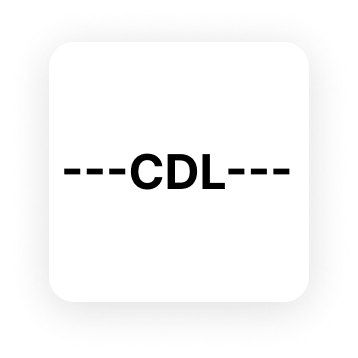

# Compact Data Language (CDL): The Future of Data Serialization

<div align="center">
  
</div>

## Introduction

In today's data-driven world, where every byte and millisecond counts, Compact Data Language (CDL) emerges as a revolutionary serialization format. Born from the need for extreme efficiency in big data applications, CDL challenges conventional formats like JSON and YAML by offering unprecedented compactness without sacrificing readability or functionality.

## Why CDL?

### The Current Challenge
Modern applications face three critical challenges in data handling:

1. **Storage Explosion**
   - Data volumes doubling every 2 years
   - Storage costs increasing
   - Network bandwidth limitations
   - Backup and recovery complexity

2. **Performance Bottlenecks**
   - Slow parsing of large datasets
   - High memory consumption
   - CPU-intensive operations
   - Network transfer delays

3. **Scalability Issues**
   - Poor handling of big data
   - Limited streaming capabilities
   - Complex data structures
   - Resource-intensive operations

## CDL: A Revolutionary Solution

### Core Principles

1. **Extreme Compactness**
   - Zero whitespace design
   - Single-character delimiters
   - Minimal syntax overhead
   - 20-30% smaller than JSON

2. **Lightning-Fast Processing**
   - Linear time complexity
   - Memory-optimized parsing
   - Efficient streaming
   - Quick search capabilities

3. **Big Data Ready**
   - Terabyte-scale support
   - Streaming capabilities
   - Memory-efficient
   - Fast processing

## Technical Excellence

### Elegant Syntax

CDL's syntax is both powerful and simple:

```
---name|age|city:Alice,30,"New York"---
```

Key elements:
- `---` Document boundaries
- `|` Key separator
- `:` Key-value separator
- `,` Value separator
- `()` Object enclosure
- `[]` Array enclosure

### Rich Data Types

1. **Basic Types**
   - Strings (with smart quoting)
   - Numbers (integer/float)
   - Booleans
   - Null values

2. **Complex Types**
   - Nested objects
   - Arrays
   - Mixed collections

### Performance Metrics

1. **Speed**
   - Serialization: O(n)
   - Deserialization: O(n)
   - Search: O(n)
   - Validation: O(n)

2. **Efficiency**
   - Storage: O(n)
   - Memory: O(n)
   - Search: O(m) for matches

## Real-World Impact

### 1. Data Lakes
```cdl
---sensors:[id|type|readings:temp_001,temperature,[timestamp|value:1684567890,23.5,1684567891,23.6]]---
```
- 60% smaller than JSON
- Faster querying
- Reduced storage costs
- Better compression

### 2. Log Management
```cdl
---logs:[timestamp|level|message:1684567890,ERROR,"Connection failed",1684567891,INFO,"Connection restored"]---
```
- Compact storage
- Fast parsing
- Efficient searching
- Reduced disk usage

### 3. IoT Data
```cdl
---devices:[id|status|metrics:device_001,active,[temperature|humidity:23.5,45.2],device_002,standby,[temperature|humidity:22.8,44.9]]---
```
- Efficient storage
- Fast processing
- Reduced bandwidth
- Better organization

## Implementation Guide

### Basic Usage

```javascript
const { CDLSerializer, CDLDeserializer } = require('cdl-js');

// Simple object
const user = {
  name: "Alice",
  age: 30,
  city: "New York"
};
const cdl = CDLSerializer.serialize(user);
// ---name|age|city:Alice,30,"New York"---

// Complex structure
const company = {
  name: "TechCorp",
  departments: [
    { name: "Engineering", size: 50 },
    { name: "Sales", size: 30 }
  ]
};
const cdl = CDLSerializer.serialize(company);
// ---name|departments:TechCorp,[name|size:Engineering,50,Sales,30]---
```

### Advanced Patterns

1. **Nested Structures**
```javascript
const config = {
  database: {
    host: "localhost",
    port: 5432,
    credentials: {
      user: "admin",
      password: "secret"
    }
  }
};
// CDL: ---database:(host|port|credentials:"localhost",5432,(user|password:admin,secret))---
```

2. **Array Operations**
```javascript
const users = [
  { name: "Alice", role: "admin" },
  { name: "Bob", role: "user" }
];
// CDL: ---users:[name|role:Alice,admin,Bob,user]---
```

## Competitive Advantages

### vs JSON
- 20-30% smaller size
- Faster parsing
- Better memory usage
- More compact syntax

### vs YAML
- Much smaller size
- Faster processing
- No indentation issues
- Better for big data

### vs Protocol Buffers
- Human-readable
- No schema needed
- More flexible
- Easier debugging

## Future Vision

### Upcoming Features
1. **Version 2.1**
   - Enhanced streaming
   - Better compression
   - More language bindings

2. **Version 2.2**
   - Advanced validation
   - Performance optimizations
   - Extended tooling

3. **Version 3.0**
   - Schema support
   - Query language
   - Advanced analytics

## Getting Started

### Quick Start
```bash
# Install
npm install cdl-js

# Basic usage
const { CDLSerializer } = require('cdl-js');
const data = { name: "Alice", age: 30 };
const cdl = CDLSerializer.serialize(data);
```

### Resources
- [GitHub Repository](https://github.com/corpobit/CDL)
- [Documentation](https://github.com/corpobit/CDL/docs)
- [Examples](https://github.com/corpobit/CDL/examples)
- [Community](https://github.com/corpobit/CDL/discussions)

## Conclusion

CDL represents a paradigm shift in data serialization. By focusing on extreme efficiency without compromising usability, it offers a compelling solution for modern data challenges. Whether you're building a data lake, managing logs, or handling IoT data, CDL provides the tools you need to work with data more efficiently than ever before.

## References

1. [CDL GitHub](https://github.com/corpobit/CDL)
2. [Specification](https://github.com/corpobit/CDL/blob/main/README.md)
3. [Documentation](https://github.com/corpobit/CDL/docs)
4. [Examples](https://github.com/corpobit/CDL/examples)

---

*This article is part of the CDL documentation. For more information, visit [https://github.com/corpobit/CDL](https://github.com/corpobit/CDL).* 